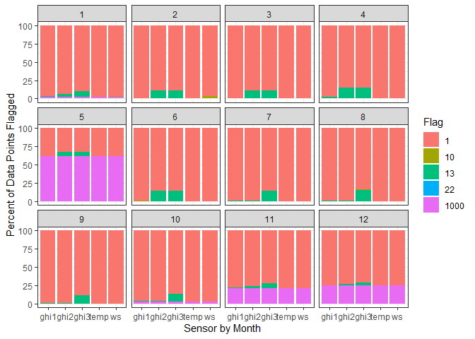
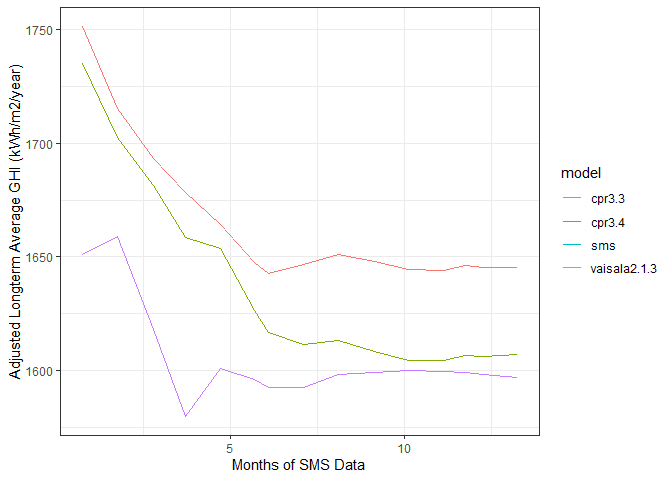
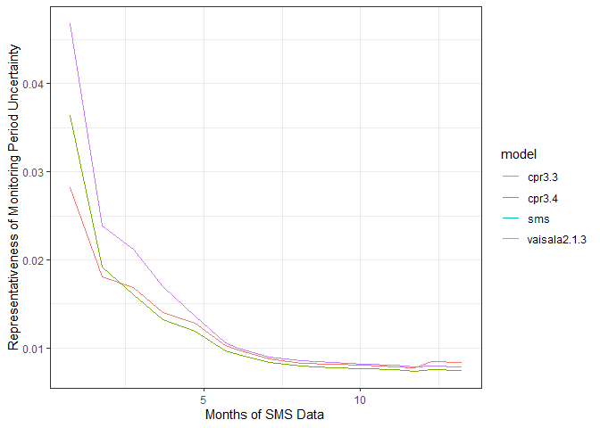

powerResource
=============

<!-- badges: start -->
<!-- badges: end -->

powerResource is a package designed to improve solar resource data
analysis. Most engineers use a compilation of spreadsheet templates to
organize all of their onsite solar resource measurements, compare this
data to satellite models, and predict future solar resource statistics.
To handle the amount of data involved in these analyses and to perform
all of the complex calculations, these spreadsheets end up being very
clunky and slow. These templates also have ample room for human error.
Utilizing a scripting language (R), drastically speeds up the analysis,
ensures reproducibility, and reduces errors. This package unlocks a
workflow that will be accessible to engineers with little programming
experience.

Installation
------------

The easiest way to install this package from github is to use the
‘devtools’ package. To make sure you have that, you can run the code:

``` r
install.packages('devtools')
```

If you have that package installed, then you can install powerResource
with the following code:

``` r
devtools::install_github('btaute/powerResource')
```

This package takes advantage of the excellent group of packages made
available by RStudio known as the TidyVerse. I strongly recommend you
install and use RStudio to serve as your development environment and you
also install the tidyverse packages with

``` r
install.packages('tidyverse')
```

Example Analysis
----------------

Once you have the package installed, the following examples will show
how to utilize the package to evaluate onsite data and perform an “MCP”.
The term MCP describes the method of Measuring onsite data, Correlating
it to long-term satellite models, and then Predicting future solar
resource for that location.

### Set Up Working Directory

To start your data analysis, you will want to have all of your datasets
accessible in one location. You’ll also want to save the script that you
use to run your analysis in this location so that future you or
colleagues can go back and reproduce your work. This collection of files
and folders into one directory is called a repository. This example uses
a repository organized like the following: example\_repository/
example\_script.R data/ groundwork/ cpr/ vaisala/ tmy/

The folders “groundwork”, “cpr”, “vaisala”, and “tmy” within the “data”
folder each contain the CSVs that have the data we plan to use in the
analysis. Groundwork is the company that supplies the onsite data for
this analysis, Clean Power Research has satellite model datasets that
will be used as one source of longterm datasets, and Vaisala is another
company that provides satellite model datasets to be used as a source of
our longterm datasets.

You will want to make this repository your “working directory” so that
you can easily access all the data with your code. To do this, put the
following code at the top of your example\_script.R file, but be sure to
put the correct path to the repository on your computer. I’m guessing
your username isn’t “btaute”… Note that you need to use “/” instead of
"" if you have folders to navigate through folders.

``` r
setwd('C:/Users/btaute/Documents/example_respository')
```

### Import Data

Now you want to load in all the data you have in your repository. The
script below shows a couple different ways to accomplish that. Note that
it starts out by loading in the powerResource package so we can have
access to its functions. These examples also make use of the tidyverse
packages.

``` r
## Load the powerResource package
library(powerResource)
library(tidyverse)

## Save all of the files in the groundwork folder that end in CSV in a list
groundwork_files <- paste0('data/groundwork/', dir(path = "data/groundwork/", pattern = "*.csv"))

## Read in the groundwork files, clean up all of the variables, and save them as a dataframe named sms_flagged
sms_flagged <- read_groundwork(groundwork_files)

## Save a list of the files in the cpr folder
cpr_files <- c('data/cpr/cpr_timeseries_v33.csv', 'data/cpr/cpr_timeseries_v34.csv')

## Read in the cpr files, clean up all of the variable names, and save them in a named list
cpr_list <- read_cpr(cpr_files)

## Read in a single vaisala time series file, clean up its variable names, and save it in a named list
vaisala_list <- read_vaisala('data/vaisala/vaisala_timeseries.csv')
```

Let’s check that all of that data imported correctly.

``` r
head(sms_flagged)
```

    #> # A tibble: 6 x 13
    #>   datetime            month  year   ghi1   ghi2   ghi3    ws  temp ghi1_flag
    #>   <dttm>              <dbl> <dbl>  <dbl>  <dbl>  <dbl> <dbl> <dbl>     <dbl>
    #> 1 2018-11-08 20:48:00    11  2018 -0.452 -0.534 -0.383  2.96  0.5          1
    #> 2 2018-11-08 20:49:00    11  2018 -0.472 -0.556 -0.387  3.00  0.5          1
    #> 3 2018-11-08 20:50:00    11  2018 -0.480 -0.570 -0.396  3.64  0.59         1
    #> 4 2018-11-08 20:51:00    11  2018 -0.480 -0.570 -0.335  2.34  0.6          1
    #> 5 2018-11-08 20:52:00    11  2018 -0.483 -0.578 -0.255  2.13  0.6          1
    #> 6 2018-11-08 20:53:00    11  2018 -0.495 -0.580 -0.274  2.72  0.6          1
    #> # ... with 4 more variables: ghi2_flag <dbl>, ghi3_flag <dbl>, ws_flag <dbl>,
    #> #   temp_flag <dbl>

``` r
summary(sms_flagged)
```

    #>     datetime                       month             year     
    #>  Min.   :2018-11-08 20:48:00   Min.   : 1.000   Min.   :2018  
    #>  1st Qu.:2019-03-01 03:35:45   1st Qu.: 3.000   1st Qu.:2019  
    #>  Median :2019-06-21 10:23:30   Median : 7.000   Median :2019  
    #>  Mean   :2019-06-21 10:23:30   Mean   : 6.743   Mean   :2019  
    #>  3rd Qu.:2019-10-11 17:11:15   3rd Qu.:11.000   3rd Qu.:2019  
    #>  Max.   :2020-01-31 23:59:00   Max.   :12.000   Max.   :2020  
    #>                                                               
    #>       ghi1              ghi2              ghi3               ws         
    #>  Min.   :  -4.33   Min.   :  -4.51   Min.   : -35.94   Min.   :   0.00  
    #>  1st Qu.:  -1.25   1st Qu.:  -1.25   1st Qu.:  -0.74   1st Qu.:   1.00  
    #>  Median :   1.18   Median :   1.30   Median :   0.73   Median :   2.00  
    #>  Mean   : 159.42   Mean   : 159.50   Mean   : 158.18   Mean   :  11.54  
    #>  3rd Qu.: 233.90   3rd Qu.: 234.40   3rd Qu.: 230.57   3rd Qu.:   3.42  
    #>  Max.   :1277.28   Max.   :1276.14   Max.   :1334.39   Max.   :3277.00  
    #>  NA's   :68934     NA's   :68934     NA's   :68934     NA's   :68934    
    #>       temp          ghi1_flag        ghi2_flag        ghi3_flag     
    #>  Min.   :-15.30   Min.   :   1.0   Min.   :   1.0   Min.   :   1.0  
    #>  1st Qu.:  2.70   1st Qu.:   1.0   1st Qu.:   1.0   1st Qu.:   1.0  
    #>  Median : 11.27   Median :   1.0   Median :   1.0   Median :   1.0  
    #>  Mean   : 12.03   Mean   : 107.5   Mean   : 108.1   Mean   : 108.6  
    #>  3rd Qu.: 21.68   3rd Qu.:   1.0   3rd Qu.:   1.0   3rd Qu.:   1.0  
    #>  Max.   : 34.90   Max.   :1000.0   Max.   :1000.0   Max.   :1000.0  
    #>  NA's   :68934                                                      
    #>     ws_flag         temp_flag     
    #>  Min.   :   1.0   Min.   :   1.0  
    #>  1st Qu.:   1.0   1st Qu.:   1.0  
    #>  Median :   1.0   Median :   1.0  
    #>  Mean   : 107.5   Mean   : 107.5  
    #>  3rd Qu.:   1.0   3rd Qu.:   1.0  
    #>  Max.   :1000.0   Max.   :1000.0  
    #> 

``` r
head(cpr_list)
```

    #> $cpr3.3
    #> # A tibble: 195,048 x 9
    #>    datetime             year month   ghi   dni   dhi  temp    ws model 
    #>    <dttm>              <dbl> <dbl> <dbl> <dbl> <dbl> <dbl> <dbl> <chr> 
    #>  1 1998-01-01 01:00:00  1998     1     0     0     0     0     7 cpr3.3
    #>  2 1998-01-01 02:00:00  1998     1     0     0     0     0     7 cpr3.3
    #>  3 1998-01-01 03:00:00  1998     1     0     0     0     0     7 cpr3.3
    #>  4 1998-01-01 04:00:00  1998     1     0     0     0     0     7 cpr3.3
    #>  5 1998-01-01 05:00:00  1998     1     0     0     0     0     7 cpr3.3
    #>  6 1998-01-01 06:00:00  1998     1     0     0     0    -1     7 cpr3.3
    #>  7 1998-01-01 07:00:00  1998     1     0     0     0    -1     7 cpr3.3
    #>  8 1998-01-01 08:00:00  1998     1     5    14     5     0     8 cpr3.3
    #>  9 1998-01-01 09:00:00  1998     1   117   336    66     1     8 cpr3.3
    #> 10 1998-01-01 10:00:00  1998     1   148   160   100     2     9 cpr3.3
    #> # ... with 195,038 more rows
    #> 
    #> $cpr3.4
    #> # A tibble: 194,280 x 9
    #>    datetime             year month   ghi   dni   dhi  temp    ws model 
    #>    <dttm>              <dbl> <dbl> <dbl> <dbl> <dbl> <dbl> <dbl> <chr> 
    #>  1 1998-01-01 01:00:00  1998     1     0     0     0     3     6 cpr3.4
    #>  2 1998-01-01 02:00:00  1998     1     0     0     0     3     6 cpr3.4
    #>  3 1998-01-01 03:00:00  1998     1     0     0     0     2     6 cpr3.4
    #>  4 1998-01-01 04:00:00  1998     1     0     0     0     2     6 cpr3.4
    #>  5 1998-01-01 05:00:00  1998     1     0     0     0     2     7 cpr3.4
    #>  6 1998-01-01 06:00:00  1998     1     0     0     0     2     7 cpr3.4
    #>  7 1998-01-01 07:00:00  1998     1     0     0     0     2     6 cpr3.4
    #>  8 1998-01-01 08:00:00  1998     1     5    16     5     2     6 cpr3.4
    #>  9 1998-01-01 09:00:00  1998     1   115   290    71     3     6 cpr3.4
    #> 10 1998-01-01 10:00:00  1998     1   154   159   106     6     7 cpr3.4
    #> # ... with 194,270 more rows

``` r
head(vaisala_list)
```

    #> $vaisala2.1.3
    #> # A tibble: 203,039 x 9
    #>    datetime             year month   ghi   dni   dhi  temp    ws model       
    #>    <dttm>              <dbl> <dbl> <dbl> <dbl> <dbl> <dbl> <dbl> <chr>       
    #>  1 1996-12-31 19:00:00  1996    12     0     0     0  7.22  1.42 vaisala2.1.3
    #>  2 1996-12-31 20:00:00  1996    12     0     0     0  6.73  1.55 vaisala2.1.3
    #>  3 1996-12-31 21:00:00  1996    12     0     0     0  6.49  1.75 vaisala2.1.3
    #>  4 1996-12-31 22:00:00  1996    12     0     0     0  6.46  1.98 vaisala2.1.3
    #>  5 1996-12-31 23:00:00  1996    12     0     0     0  6.04  2.33 vaisala2.1.3
    #>  6 1997-01-01 00:00:00  1997     1     0     0     0  5.21  2.81 vaisala2.1.3
    #>  7 1997-01-01 01:00:00  1997     1     0     0     0  4.64  3.15 vaisala2.1.3
    #>  8 1997-01-01 02:00:00  1997     1     0     0     0  4.58  3.37 vaisala2.1.3
    #>  9 1997-01-01 03:00:00  1997     1     0     0     0  4.77  3.45 vaisala2.1.3
    #> 10 1997-01-01 04:00:00  1997     1     0     0     0  4.84  3.41 vaisala2.1.3
    #> # ... with 203,029 more rows

You can also break up the process of importing the onsite data by using
the following workflow:

``` r
## Import the files
groundwork_df <- import_groundwork_files(groundwork_files)

## Tidy the Dataframe
tidy_sms <- tidy_groundwork(groundwork_df)

## Flag the Dataframe
sms_flagged <- flag_sms(tidy_sms)
```

### Evaluate Onsite Measured Data

It’s important to note the flags that Groundwork attaches to each
measurement of the onsite data. An important metric of the quality of
the data is the percentage of data that is flagged. With our data in a
tidy format, it’s easy to visualize this. For a complete description of
the flag definitions, please reference Groundwork’s monthly reports.

``` r
## Get the flag count dataframe
flag_count <- count_flags(sms_flagged)

## Plot the monthly data recovery results
plot_flag_count_bar_chart(flag_count)
```



### Create a Megaframe!

Once you have evaluated the onsite data, it’s time to correlate it with
the longterm satellite model datasets. To do this, we need to compile
all of the datasets into one large dataframe, what I call a Megaframe!
This can be done with the following code:

``` r
## Prepare for Megaframe
sms <- prepare_sms_flagged_for_megaframe(sms_flagged, flagged_data_is_filtered = TRUE)

## Create the Megaframe!
megaframe <- compile_megaframe(sms, cpr_list, vaisala_list)
```

The code below breaks down the steps of
prepare\_sms\_flagged\_for\_megaframe().

``` r
sms_filtered <- filter_sms(sms_flagged)
sms_averaged <- average_ghi_sensors(sms_filtered)
sms_hourly <- average_data_to_hourly(sms_averaged)
sms <- format_sms_vars_for_megaframe(sms_hourly)
```

### Run an MCP Method 1:

There are two ways to calculate the results of the MCP. The first is
done by creating an MCP object, which will store all of the inputs and
results of the MCP in one location. This is the simplest method.

``` r
## Create the MCP object by giving it the megaframe parameter
my_mcp <- MCP(megaframe)

## Run the mcp
my_mcp$run()

## Get the results of the mcp
my_mcp$get_results()
```

    #> # A tibble: 21 x 12
    #>    model longterm_resour~ sensor longterm_adjust~ timestep   por     iav sms_por
    #>    <chr>            <dbl> <chr>             <dbl> <chr>    <dbl>   <dbl>   <dbl>
    #>  1 cpr3~           1578.  ghi              1644.  daily    22.3   0.0341    1.10
    #>  2 cpr3~           1578.  ghi              1642.  hourly   22.3   0.0341    1.10
    #>  3 cpr3~           1578.  ghi              1607.  daily    22.2   0.0308    1.10
    #>  4 cpr3~           1578.  ghi              1606.  hourly   22.2   0.0308    1.10
    #>  5 sms             1532.  ghi                NA   <NA>      1.10 NA         1.10
    #>  6 vais~           1559.  ghi              1597.  daily    23.2   0.0329    1.10
    #>  7 vais~           1559.  ghi              1592.  hourly   23.2   0.0329    1.10
    #>  8 cpr3~             14.4 temp               14.4 daily    22.3   0.0539    1.10
    #>  9 cpr3~             14.4 temp               14.4 hourly   22.3   0.0539    1.10
    #> 10 cpr3~             14.8 temp               14.0 daily    22.2   0.0514    1.10
    #> # ... with 11 more rows, and 4 more variables: adj.r.squared <dbl>,
    #> #   r.squared <dbl>, sigma <dbl>, rom <dbl>

You can also view the MCP results in a more convenient format, broken
out by the timestep used in the MCP (hourly or daily).

``` r
my_mcp$get_daily_results_table()
```

| sensor | model        | timestep |  longterm\_resource|  longterm\_adjustment|  r.squared|        iav|        rom|
|:-------|:-------------|:---------|-------------------:|---------------------:|----------:|----------:|----------:|
| ghi    | vaisala2.1.3 | daily    |         1558.720223|           1596.867428|  0.9847949|  0.0329220|  0.0078100|
| ghi    | cpr3.4       | daily    |         1578.156018|           1606.854728|  0.9844874|  0.0307964|  0.0074459|
| ghi    | cpr3.3       | daily    |         1578.208504|           1644.474186|  0.9826992|  0.0340787|  0.0083353|
| temp   | cpr3.4       | daily    |           14.820918|             14.019656|  0.9961618|  0.0513910|  0.0113056|
| temp   | cpr3.3       | daily    |           14.406030|             14.365829|  0.9955701|  0.0538586|  0.0118892|
| temp   | vaisala2.1.3 | daily    |           13.825857|             14.386784|  0.9880819|  0.0592220|  0.0136900|
| ws     | vaisala2.1.3 | daily    |            4.512977|              2.483125|  0.6382267|  0.0345728|  0.0206383|
| ws     | cpr3.3       | daily    |            4.144328|              2.591740|  0.5281097|  0.0571327|  0.0384372|
| ws     | cpr3.4       | daily    |            3.291134|              2.437311|  0.5150573|  0.0333453|  0.0227138|

``` r
my_mcp$get_hourly_results_table()
```

| sensor | model        | timestep |  longterm\_resource|  longterm\_adjustment|  r.squared|        iav|        rom|
|:-------|:-------------|:---------|-------------------:|---------------------:|----------:|----------:|----------:|
| ghi    | vaisala2.1.3 | hourly   |         1558.720223|           1591.510175|  0.9718675|  0.0329220|  0.0085497|
| ghi    | cpr3.4       | hourly   |         1578.156018|           1605.510111|  0.9688469|  0.0307964|  0.0082598|
| ghi    | cpr3.3       | hourly   |         1578.208504|           1642.204193|  0.9663798|  0.0340787|  0.0092635|
| temp   | cpr3.4       | hourly   |           14.820918|             14.003561|  0.9843749|  0.0513910|  0.0124354|
| temp   | cpr3.3       | hourly   |           14.406030|             14.357571|  0.9828037|  0.0538586|  0.0131631|
| temp   | vaisala2.1.3 | hourly   |           13.825857|             14.375962|  0.9721408|  0.0592220|  0.0153525|
| ws     | vaisala2.1.3 | hourly   |            4.512977|              2.483620|  0.5757527|  0.0345728|  0.0221493|
| ws     | cpr3.3       | hourly   |            4.144328|              2.591382|  0.4761033|  0.0571327|  0.0403000|
| ws     | cpr3.4       | hourly   |            3.291134|              2.435817|  0.4074752|  0.0333453|  0.0248847|

### Run an MCP Method 2:

The second method of running an MCP allows you to specify a particular
timestep that you want to run (instead of running both daily and hourly
automatically).

``` r
## Filter Megaframe so we only have ghi data
megaframe_ghi_only <- select(megaframe, -temp, -ws)

## Run an MCP for daily timestep
mcp_example_2 <- run_mcp_for_single_timestep(megaframe_ghi_only, daily = TRUE)

## Get MCP Results
get_mcp_results(mcp_example_2, megaframe_ghi_only)
```

    #> # A tibble: 4 x 12
    #>   model longterm_resour~ sensor longterm_adjust~ timestep   por     iav sms_por
    #>   <chr>            <dbl> <chr>             <dbl> <chr>    <dbl>   <dbl>   <dbl>
    #> 1 cpr3~            1578. ghi               1644. daily    22.3   0.0341    1.10
    #> 2 cpr3~            1578. ghi               1607. daily    22.2   0.0308    1.10
    #> 3 sms              1532. ghi                 NA  <NA>      1.10 NA         1.10
    #> 4 vais~            1559. ghi               1597. daily    23.2   0.0329    1.10
    #> # ... with 4 more variables: adj.r.squared <dbl>, r.squared <dbl>, sigma <dbl>,
    #> #   rom <dbl>

### Evaluate SMS Campaign:

The last function we’ll demonstrate helps you evaluate the benefits of
additional onsite data. It runs an MCP after each month of onsite data
so that you can benchmark how the longterm predictions change with each
additional month of data. Typically, after about 16 months of data, you
will see that collecting more onsite data has a very small impact on the
longterm prediction. At this point, it may make sense to decommission
your onsite measurements. This plot also illustrates the danger in
running an MCP too soon, as the first couple months of onsite data have
drastically different results.

``` r
## Run Campaign
campaign_results <- run_sms_campaign(megaframe)

## Plot Longterm GHI Adjustment after each month of the campaign
plot_campaign_ghi_longterm_adjustments(campaign_results)
```



``` r
## Plot Campaign uncertainty after each month of the campaign
plot_campaign_rom_uncertainty(campaign_results)
```


